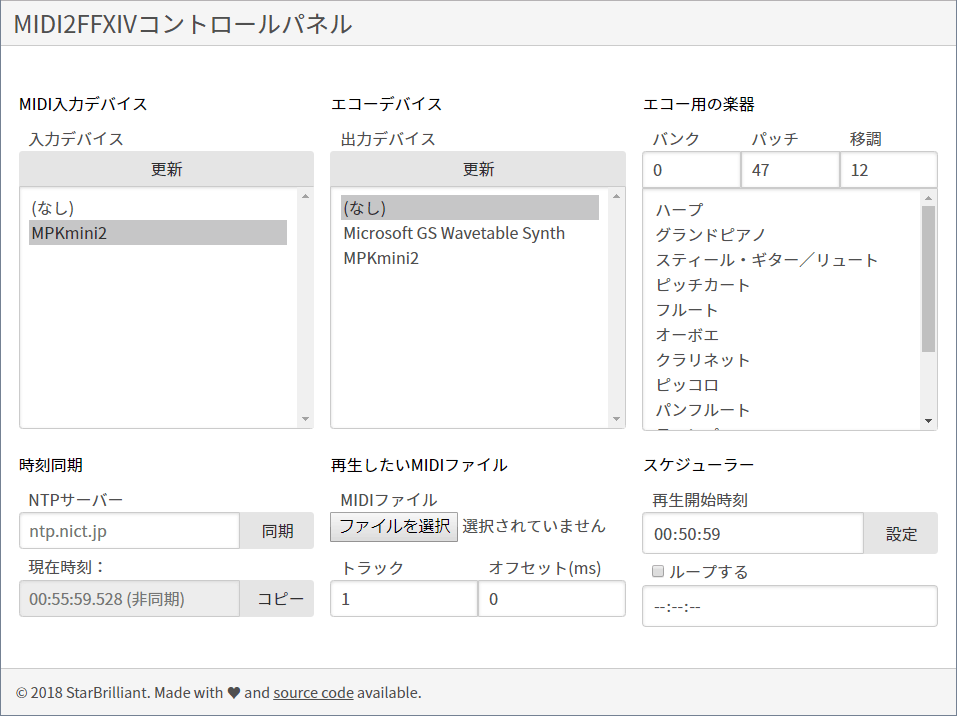
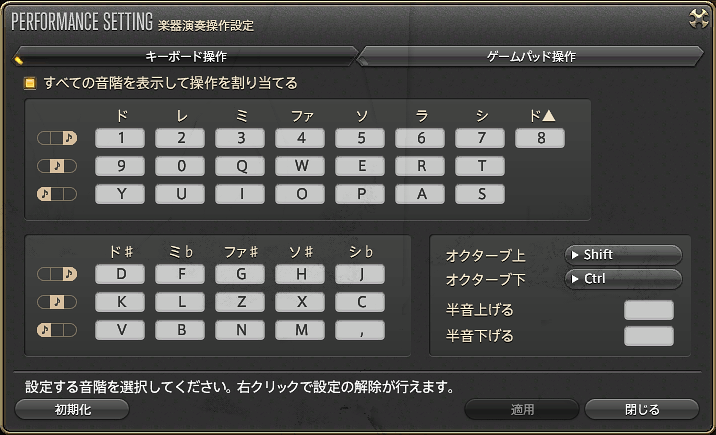

MIDI2FFXIV
==========

このソフトは、MIDI入力を_ファイナルファンタジーXIVの紅蓮のリベレーター_の吟遊詩人の演奏に変換するプログラムです。合奏にも対応しています。

使用方法
-----

ダウンロード：[midi2ffxiv-########.zip](https://github.com/logue/midi2ffxiv/releases).

このプログラムは64bitのWindows上のFFXIVのパッチ4.3以降で動作します。

このプログラムを起動し、ブラウザで(http://localhost:65300/index-ja.html)を開くと以下のようなコントロールパネルが表示されます：



この画面はスマフォなど別のコンピューターから、このゲームを起動しているパソコンのIPを入れることで遠隔操作が可能です。

モード
-----

- マニュアルソロモード
- MIDI自動再生モード
- 合奏同期モード

(備考：合奏同期モードは、演奏者はプレイヤーと同期します。公共のライブに適しています。 しかし演奏者自身は音楽を聞くことができません。)

機能
--------

- Web console: remote control with your phone / another computer (though some may think it's a disadvantage due to RAM consumption)
- 125ms note queue: auto arpeggiator
- Local MIDI echo: listen to your performance you have a low-latency hardware synthesizer
- Dumb-note fix: workaround a bug in Patch 4.3
- NTP clock sync: build your band across miles!
- Manual clock sync: a band always needs a human bandleader
- Scheduled autoplay and looping
- 1500ms delayed playback in multiplayer sync mode (You would know what I am talking about if you tried to play in sync before)

ショーケース
--------

"Saltswept" synced duet: <https://www.youtube.com/watch?v=2n6HCc1FdsQ>

"プレリュード" synced duet: <https://www.youtube.com/watch?v=yINX3F7jKkU>

キーバインド
----------

3つのキーバインドがセットされています。デフォルト設定では`midi2ffxiv.conf`が読み込まれます。この他の設定に`midi2ffxiv_no_modifier.conf`があります。

※このフォーク版では、[Bard Midi Player](http://bmp.sqnya.se/)のキーバインド設定と互換性を持つようになっています。



- `midi2ffxiv_original.conf`では、コントロールキーとシフトキーでオクターブを切り替えるようになっています。ただし、フレームレートが下がる問題があります。
- `midi2ffxiv_no_modifier.conf`は、全キーを使用したキーバインディング設定になっています。必要に応じて設定変更してください。

|      | C | D  | E  | F  | G  | A | B | C+1 |
|------|---|----|----|----|----|---|---|-----|
| High | A | D  | G  | H  | K  | ; | - | =   |
| Mid  | Q | W  | E  | R  | T  | Y | U |     |
| Low  | Z | C  | B  | N  | ,  | / | ] |     |
|      |   |    |    |    |    |   |   |     |
|      | C | Eb | F# | G# | Bb |   |   |     |
| High | S | F  | J  | L  | '  |   |   |     |
| Mid  | 2 | 3  | 5  | 6  | 7  |   |   |     |
| Low  | X | V  | M  | .  | \[ |   |   |     |

設定を変更する場合は`midi2ffxiv.conf`にリネームすることで変更できます。

ソロモードのマニュアル
----------------

MIDIキーボードやMIDIコントローラーで演奏したい場合は、「入力デバイス」で使用したいMIDIデバイスを選択して下さい。

オプション：もし、ローカルで再生テストを行いたい場合（下記詳細参照）は、「出力デバイス」で楽器を選択することで演奏できます。MIDIデバイスのボリュームを調整してゲームとMIDIデバイスとの両方で演奏を確認することもできます。

演奏を開始するときの注意として、あまり早く入力しないでください。ノートとノートの間は少なくとも125ミリ秒程度あける必要があります。

(Note: For realtime performance, MIDI2FFXIV restricts the distance between any two notes to at least 125 ms. This is also the restriction of the game, although you can change the value in [midi2ffxiv.conf](midi2ffxiv.conf).)

MIDI自動演奏モード
------------------

最初に演奏したいMIDIファイルを選択してください。[demo](demo)内にデモソングが入っています。次に演奏するトラックを選択します。

トラック１を選択したけどトラック２を聞きたい場合は、トラックに0を入力してください。これは隠し値です。

トラックを選択してから「現在時刻」の隣りにある「コピー」ボタンを押すと「演奏開始時刻」が更新されます。この隣にある「設定」ボタンを押すと、５秒後に演奏が開始されます。

演奏を止める場合は、別のコンピューターから「設定」ボタンをもう一度押すか、Shift+ESCキーを押して中断してください。

(Note: MIDI2FFXIV does not accept every MIDI file that you download from the Internet. Some will not play. If you know composing, I suggest you create your own MIDI file.)

合奏同期モード
---------------------

まず最初に「NTPサーバー」の横の「同期」ボタンを押して5～10秒程度待って時刻同期させてください。

**リハーサル用のMIDIファイル**を読み込ませて、自分が演奏するトラック番号を選択してください。

演奏を開始する時間をループリーダーと相談し、スケジューラーの「演奏開始時刻」にその時間を入力し、「設定」ボタンを押してください。

演奏バンドのリーダーは、リハーサルで「オフセット」の値を調整して他のメンバーとの同期をとってください。

「設定」ボタンを押すと演奏が中断します。次に**合奏したいMIDIファイル**を読み込ませてください。

合奏を開始したい時刻をスケジューラーに入力してください。

(注釈１：パッチ4.3以降では、演奏のレイテンシは1500ミリ秒になっています。MIDI2FFXIVは、非リアルタイムモードで設定可能な遅延をMIDI出力に追加することによって、この動作を模倣しています。)

(注釈２：演奏バンドのリーダーの役割は重要です！最低３人の設定を同期する必要があります。（２人以上の演奏者と１人のリスナー）)

ローカルエコー
----------

これはオプション設定です。ゲームよりもレイテンシの少ないローカルのシンセサイザーを使って演奏します。

通常はハードウェアシンセを使って演奏します。しかし、ソフトウェアシンセでも動作します。（例：[VirtualMIDISynth](https://coolsoft.altervista.org/en/virtualmidisynth)）

VirtualMIDISynthを使用する場合は、バッファ時間を5～１０ミリ秒程度と低レイテンシになります。

FAQ
---

1. **キーバインドを変更する方法は？**

   デフォルトのキーバインドは、[midi2ffxiv.conf](midi2ffxiv.conf)にセットされています。ノートパットなどで編集してください。

   注釈：非アルファベット文字のキーは、[Virtual-Key Codes](https://docs.microsoft.com/en-us/windows/desktop/inputdev/virtual-key-codes)のテーブルを参考に入力してください。

2. **MIDI2FFXIVを使用することでバンされることはありませんか？**

   おそらく無いと思います。というのはMIDIによる再生に関して一切の言及がないからです。

   ただし、サーバーに負荷をかけるようなMIDIファイルを再生したり、規約で禁止されている"Answers / Dragonsong / Revolutions"を再生したり著作権上問題があるものを再生したり動画を撮ったりすると問題があるかもしれません。

   また、動画をアップする際は以下のテキストを必ず追加してください：
   ```
   FINAL FANTASY XIV © 2010 - 2018 SQUARE ENIX CO., LTD. All Rights Reserved.
   ```

3. **なぜMIDI2FFXIVは管理人権限が必要なのですか？?**

   このプログラムは、管理権限がなくとも動作すると思います。その場合は`midi2ffxiv.exe.manifest`を削除してください。

   しかし、UACをクライアントが要求する場合（FFXIVの中国語版など）は、MIDI2FFXIVの動作に管理人権限が必要になるかもしれません。

4. **Do I need to permit MIDI2FFXIV to go through the firewall?**

   MIDI2FFXIVをスマフォなど別のコンピューターから操作する場合は、許可する設定にする必要があります。ただし、外部のインターネット越しにアクセスできてしまうことを意味します。そこで、パスワードでアクセス制限をかけることを推奨します。
   
   [midi2ffxiv.conf](midi2ffxiv.conf)の以下の行を編集してください：

   ```conf
   WebUsername
   WebPassword
   ```

   Add your desired username and password there.

5. **アンチウィルスソフトがMIDI2FFXIVをウィルス判定した！!**

   Mine also does.

   もしも、プリコンパイルのプログラムが信用出来ない場合は、自分でソースからコンパイルしてください。（以下参照）

6. **MIDI2FFXIVをコンパイルするには？**

   まず、[Go](https://golang.org/dl/)をダウンロードしてインストールしてください。

   コマンドプロンプトで以下のコマンドを実行します：

   ```cmd
   cd /d "ソースコードのパス"
   go get -d -u -v .
   go build
   ```

ライセンス
-------
このプログラムは、MITライセンスです。

詳細については[LICENSE](LICENSE)を参照してください。

ファイナルファンタジーはスクウェア・エニックスの登録商標です。

[demo](demo)ディレクトリに含まれるデモ曲は、このライセンスとは別です。詳細については[demo/README.txt](demo/README.txt)を参照してください。
