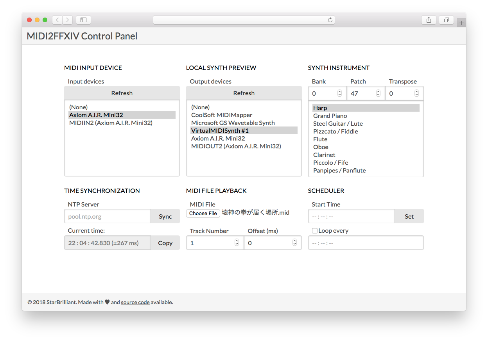

MIDI2FFXIV
==========

Convert MIDI to bard performance of _Final Fantasy XIV: Stormblood_, featuring multiplayer sync

Usage
-----

Download: [midi2ffxiv-########.zip](https://github.com/m13253/midi2ffxiv/releases).

Current version of the program runs on 64-bit Windows platform, with FFXIV Patch 4.3.

Start the program on your gaming PC, follow the process to open the control panel. You will see this:



You may also open the control panel from your phone or another computer, as long as you know the IP address of your gaming PC.

Modes
-----

- Manual solo mode
- MIDI autoplay mode
- Multiplayer sync mode

(Note: In multiplayer sync, the performers sync to the pedestrians. Suitable for public live. But the performers themselves can't hear the music.)

Features
--------

- Web console: remote control with your phone / another computer (though some may think it's a disadvantage due to RAM consumption)
- 125ms note queue: auto arpeggiator
- Local MIDI echo: listen to your performance you have a low-latency hardware synthesizer
- Dumb-note fix: workaround a bug in Patch 4.3
- NTP clock sync: build your band across miles!
- Manual clock sync: a band always needs a human bandleader
- Scheduled autoplay and looping
- 1500ms delayed playback in multiplayer sync mode (You would know what I am talking about if you tried to play in sync before)

Showcase
--------

"Saltswept" synced duet: <https://www.youtube.com/watch?v=2n6HCc1FdsQ>

"Prelude" synced duet: <https://www.youtube.com/watch?v=yINX3F7jKkU>

Keybinding
----------

Two keybinding presets are included, the default `midi2ffxiv.conf` and the alternate `midi2ffxiv_no_modifier.conf`.

- `midi2ffxiv.conf` uses Ctrl and Shift to switch octaves, but the may have issues when the frame rate is low.
- `midi2ffxiv_no_modifier.conf` uses a full-key map keybinding, you need to change your keybinding:

|      | C | D  | E  | F  | G  | A | B | C+1 |
|------|---|----|----|----|----|---|---|-----|
| High | A | D  | G  | H  | K  | ; | - | =   |
| Mid  | Q | W  | E  | R  | T  | Y | U |     |
| Low  | Z | C  | B  | N  | ,  | / | ] |     |
|      |   |    |    |    |    |   |   |     |
|      | C | Eb | F# | G# | Bb |   |   |     |
| High | S | F  | J  | L  | '  |   |   |     |
| Mid  | 2 | 3  | 5  | 6  | 7  |   |   |     |
| Low  | X | V  | M  | .  | \[ |   |   |     |

For whichever you want to use, rename it to `midi2ffxiv.conf` so it will be active.

Manual solo mode
----------------

If you want to perform with your MIDI keyboard or MIDI controller. Select your MIDI device from "Input devices".

Optional: If you want to use the local echo feature (see below for deatils), select your synth from "Output devices". Select an instrument. Adjust the volume on your MIDI controller so you can hear from both the game and the synthesizer.

Then start performing! Be careful not to play notes too fast, since you may experience latency or note loss if there are less than 125 ms between notes.

(Note: For realtime performance, MIDI2FFXIV restricts the distance between any two notes to at least 125 ms. This is also the restriction of the game, although you can change the value in [midi2ffxiv.conf](midi2ffxiv.conf).)

MIDI autoplay mode
------------------

First, load a MIDI file. You may find songs in [demo](demo). Then select the track number.

If you select Track 1 but hear Track 2, try to type in "Track 0", that is a hidden value.

After selecting the track, click "Copy" next to "Current time". Then click "Set" next to "Start time". The MIDI playback will begin in 5 seconds.

(Note: MIDI2FFXIV does not accept every MIDI file that you download from the Internet. Some will not play. If you know composing, I suggest you create your own MIDI file.)

Multiplayer sync mode
---------------------

First, click "Sync" next to "NTP server", wait 5 or 10 seconds for synchronization to succeed.

Load your **rehearsal MIDI file**. Then select the track number.

Discuss a rehearsal time with your band leader, type in the "Start time", click "Set" to start the scheduler.

During the rehearsal, the band leader adjusts everyone's "Offset" value so your orchestra is in sync.

Click "Set" to stop playing, load your **performance MIDI file**.

Discuss an official start time and set the scheduler.

(Note 1: As of Patch 4.3, the latency between the performer and the audience is around 1500 ms. MIDI2FFXIV mimics this behavior by adding configurable delay to MIDI output in non-realtime mode.)

(Note 2: Band leader is very important! You need at least 3 persons to adjust syncing settings. (2+ performers, 1 listener))

Local echo
----------

This is an optional feature. If you have a local synthesizer with lower latency than the game, you can use it to produce sound, instead of the game.

Usually it is useful if you have a hardware synth, but software synth also works. (e.g. [VirtualMIDISynth](https://coolsoft.altervista.org/en/virtualmidisynth))

If you use VirtualMIDISynth, you can reduce its buffer time to 5 - 10 ms for lower latency.

FAQ
---

1. **How to change keybindings?**

   The default keybinding is stored in [midi2ffxiv.conf](midi2ffxiv.conf). Open it with Notepad and play around with it.

   Note: For any non-alphanumeric keys, please look up the [Virtual-Key Codes](https://docs.microsoft.com/en-us/windows/desktop/inputdev/virtual-key-codes) table for key codes.

2. **Will I get banned for using MIDI2FFXIV?**

   I guess you will not. I don't see any words prohibiting the use of MIDI.

   But remember, please do not burden the server by loading crazy MIDI files, and do not post any video of performing the song "Answers / Dragonsong / Revolutions" otherwise you will get copyright infringement takedown.

   Also, please add the following notice to your uploaded video:
   ```
   FINAL FANTASY XIV © 2010 - 2018 SQUARE ENIX CO., LTD. All Rights Reserved.
   ```

3. **Why does MIDI2FFXIV require administrative rights?**

   This program should work without administrator, just delete the file `midi2ffxiv.exe.manifest`.

   However, for some users whose game client is run under UAC (especially FFXIV China Edition), administrative rights is required for MIDI2FFXIV.

4. **Do I need to permit MIDI2FFXIV to go through the firewall?**

   If you need to control MIDI2FFXIV with your phone or another computer, please allow it. But if your gaming PC is directly connect to the outside Internet without any protection, I suggest you add a password.

   Edit [midi2ffxiv.conf](midi2ffxiv.conf), find the following lines:

   ```conf
   WebUsername
   WebPassword
   ```

   Add your desired username and password there.

5. **My anti-virus says MIDI2FFXIV is a virus!**

   Mine also does.

   If you don't trust the pre-compiled program, you can compile the program yourself. (see below)

6. **How to compile MIDI2FFXIV on my own?**

   You will need to download [Go](https://golang.org/dl/) to recompile the program.

   Type the following commands into "Command Prompt" to compile the program:

   ```cmd
   cd /d "SOURCE CODE PATH"
   go get -d -u -v .
   go build
   ```

License
-------

This program is licensed under MIT License.

For more information, please refer to [LICENSE](LICENSE).

Demo songs in [demo](demo) directory may have separate licensing information, please refer to [demo/README.txt](demo/README.txt).

FINAL FANTASY is a registered trademark of Square Enix Holdings Co., Ltd.
